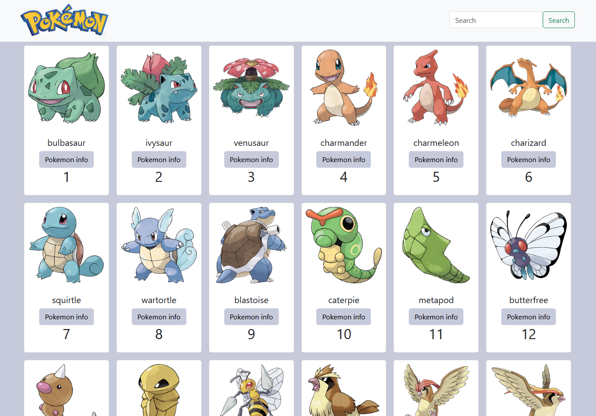
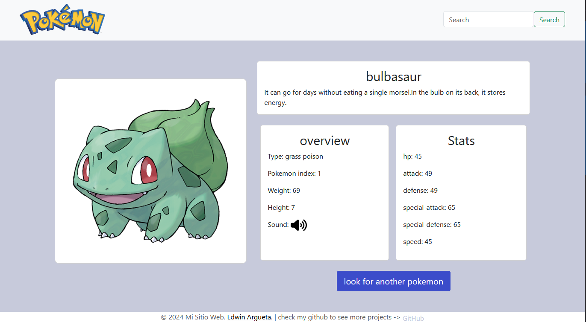
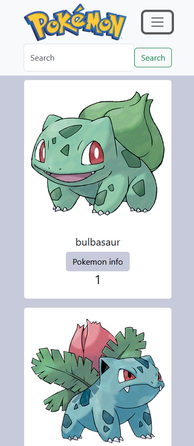
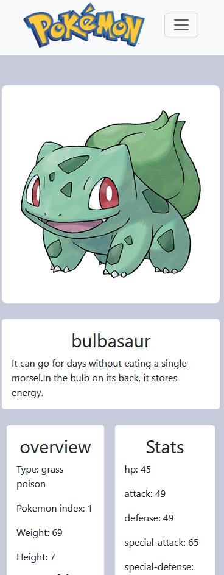

# Pokedex App

## Overview!

**Fully Responsive Pokedex**

In this project, I created a fully responsive Pokedex app using HTML, Sass, Bootstrap, and JavaScript. The app fetches data from the Pokémon API to display information about various Pokémon, including their abilities, types, and much more.

This Pokedex app was built entirely by myself, ensuring a user-friendly interface and an accurate representation of the data provided by the API. The use of Sass and Bootstrap helped streamline the styling and responsiveness of the application.

# Pokedex App Images

